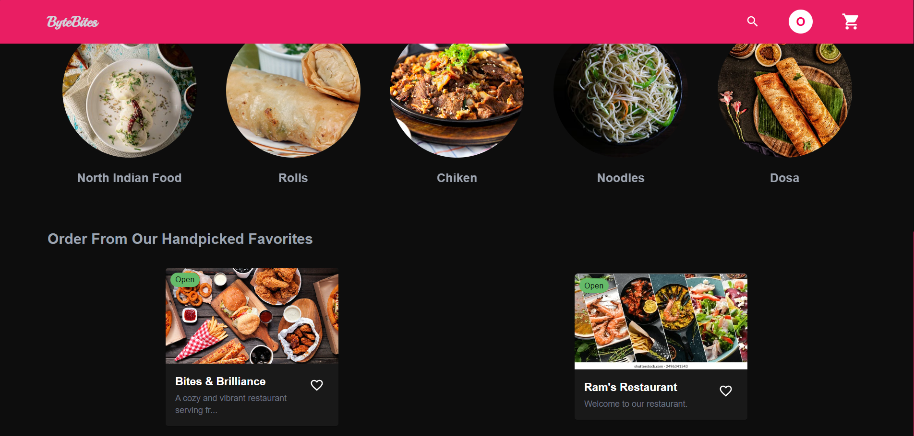
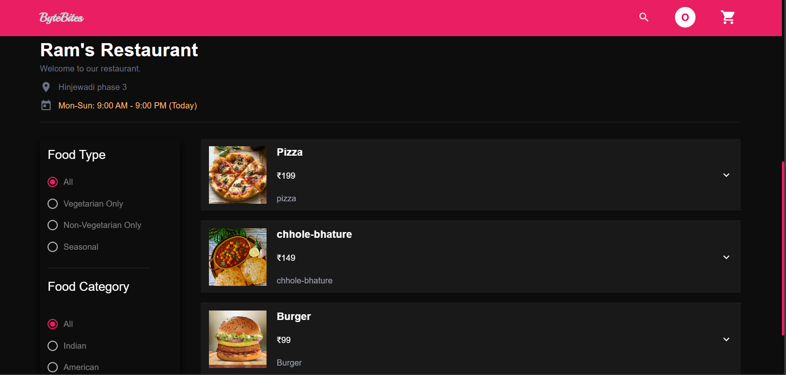
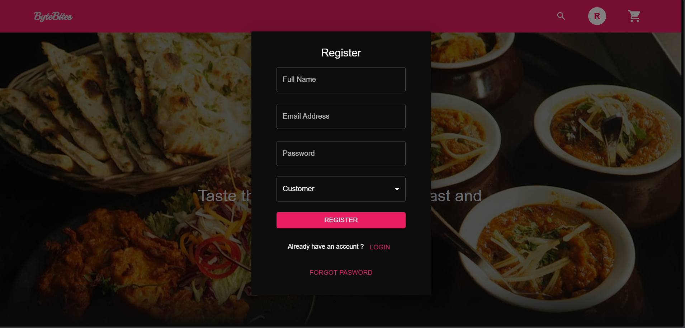
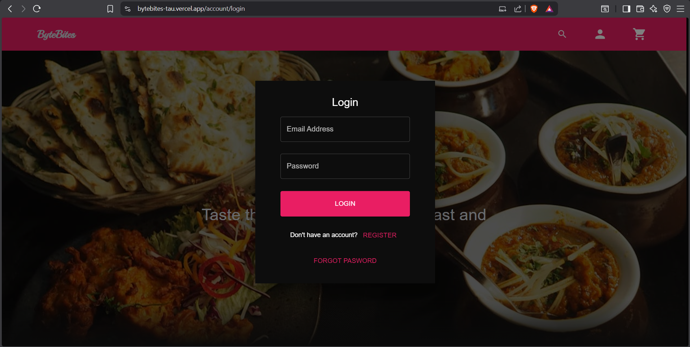
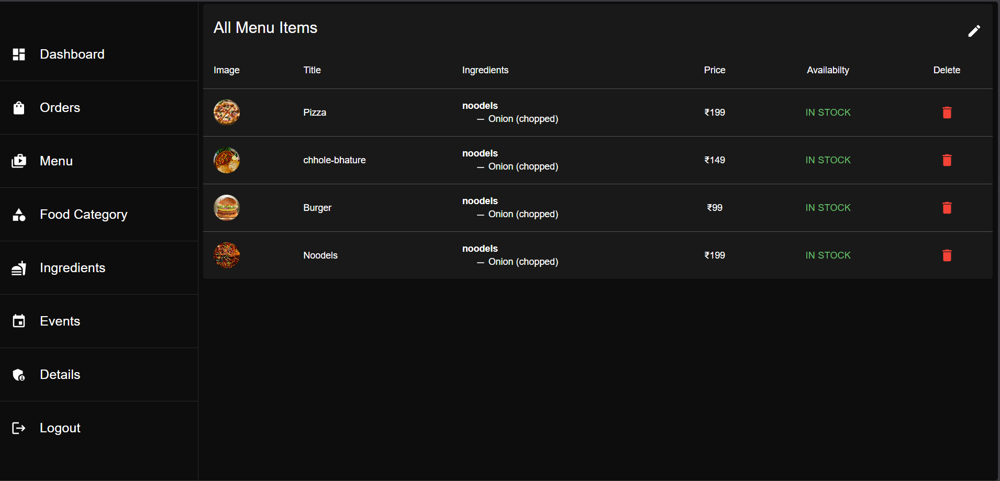

# ByteBites — Full-Stack Food Ordering Platform

ByteBites is a production-style food ordering platform built with a React frontend and Spring Boot backend. It supports three personas—**Customer**, **Restaurant Admin**, and **Super Admin**—with role-specific workflows for ordering, restaurant operations, and platform governance.

## 🌐 Live Demo

**Deployed App:** https://bytebites-tau.vercel.app/

---

## 🚀 Project Highlights

- End-to-end full-stack architecture (UI, API, data, security)
- Role-based authentication and authorization
- Real-world ordering lifecycle (browse → cart → checkout → order tracking)
- Admin tools for restaurant and menu operations
- Modern frontend ecosystem with scalable state management

---

## 🧩 System Overview

This repository includes:

- `frontend-react/` — React + Redux client application
- `backend-springboot/` — Spring Boot REST APIs and business logic
- `images/` — Product screenshots used in this documentation

---

## ✅ Core Feature Set

### Customer Experience

- Registration and login flows
- Browse restaurants and menus
- Cart, checkout, and payment flow
- Profile and account management

### Restaurant Admin Experience

- Restaurant creation and management
- Menu, categories, and ingredient management
- Event management
- Order processing workflows

### Super Admin Experience

- Platform-level visibility and governance controls
- Restaurant request and management workflows

### Backend Platform Capabilities

- JWT-based authentication + protected APIs
- Role-aware authorization
- Modular services for cart, orders, reviews, notifications, and payments
- Email and password reset support

---

## 🛠️ Tech Stack

### Frontend

- React 18
- Redux + Redux Thunk
- React Router
- Material UI (MUI)
- Formik + Yup
- Axios
- Tailwind CSS

### Backend

- Java 17
- Spring Boot 3
- Spring Security + Spring Data JPA
- JWT (jjwt)
- MySQL Connector
- Stripe Java SDK
- Spring Mail

---

## 🖼️ Product Screenshots

> **Image mapping rule used:** files starting with `admin` are shown under Admin; all others are shown under Customer.

### Customer Screens

#### Customer Homepage


#### Restaurant Discovery


#### Registration Page


#### Login Page


#### Customer Flow — Additional Views


### Admin Screens

#### Admin Menu Management


---

## 📂 Repository Structure

```text
bytebites/
├── backend-springboot/
├── frontend-react/
├── images/
└── README.md
```

---

## ▶️ Local Development

### Frontend

```bash
cd frontend-react
npm install
npm start
```

### Backend

```bash
cd backend-springboot
./mvnw spring-boot:run
```

> Before running in a real environment, configure DB, JWT, Stripe, and Mail settings.

---

## 📌 Engineering Value

ByteBites demonstrates practical full-stack engineering across product design, API architecture, security, and role-based experience design. It reflects the ability to ship user-facing features while maintaining clean backend modularity and scalable project structure.
